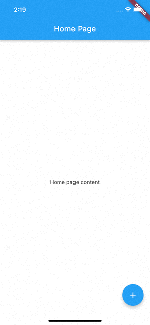

# Flutter Hero Page Route Transition

This article will help you build a smooth [Hero](https://api.flutter.dev/flutter/widgets/Hero-class.html) transition from a `FloatingActionButton` to another page while gaining full control of the route transition animation.



## Getting Started

To run the project open the iPhone simulator and run terminal command `flutter run`.

This article assumes basic knowledge of [Flutter](https://flutter.dev/) and [Dart](https://dart.dev/).

You can find the complete project [here](https://github.com/stassop/flutter_hero_page_route).

## Route Transition Basics

To [switch to a new route](https://flutter.dev/docs/cookbook/navigation/navigation-basics), we'd normally use `Navigator.push()` passing either a `MaterialPageRoute`, which uses a platform-specific animation, or a `PageRouteBuilder`, which allows more [refined control](https://flutter.dev/docs/cookbook/animation/page-route-animation) of how page transition takes place.

In this case, however, we want to leverage [Hero animations](https://flutter.dev/docs/cookbook/navigation/hero-animations) to create a page transition from a `FloatingActionButton` while retaining full control of the animation timing and duration. We also want the button to morph into the new page instead of the page just popping up on screen.

Furthermore, we want to encapsulate all this logic in a separate widget class so that when a new route is pushed onto the navigation stack the code looks as concise as possible.

## Hero Page Route Widget

At the top level our code looks like this:

```
Navigator.of(context).push(
  HeroPageRoute(
    tag: 'Hero Page',
    child: HeroPage(),
  )
);
```

Let's have a look at what happens inside `HeroPageRoute`.

`HeroPageRoute` extends `PageRouteBuilder` to give it control over transition duration and animation. The widget returns a `Hero` with a [custom transition tween](https://api.flutter.dev/flutter/widgets/Hero/createRectTween.html) and a child widget that uses the `PageRouteBuilder`'s animation controller to animate the new page:

```
class HeroPageRoute extends PageRouteBuilder {
  final String tag;
  final Widget child;

  HeroPageRoute({
    required this.tag,
    required this.child,
  }) : super(
    transitionDuration: Duration(milliseconds: 1000),
    reverseTransitionDuration: Duration(milliseconds: 1000),
    pageBuilder: (
      BuildContext context,
      Animation<double> animation,
      Animation<double> secondaryAnimation,
    ) {
      return Hero(
        tag: tag,
        createRectTween: (Rect? begin, Rect? end) {
          return CurvedRectArcTween(begin: begin, end: end);
        },
        child: PageRouteAnimation(
          child: child,
          animation: animation,
        ),
      );
    },
  );
}
```

`Hero`'s `createRectTween` param allows you to define a custom transition tween. In this case we don't want to completely replace the default `MaterialRectArcTween`, but only control the transition timing using [easing Curves](https://api.flutter.dev/flutter/animation/Curves-class.html). `CurvedRectArcTween` extends `MaterialRectArcTween` and overrides its parent class [lerp method](https://api.flutter.dev/flutter/animation/Tween/lerp.html):

```
class CurvedRectArcTween extends MaterialRectArcTween {
  CurvedRectArcTween({
    Rect? begin,
    Rect? end,
  }) : super(begin: begin, end: end);

  @override
  Rect lerp(double t) {
    Cubic easeInOut = Cubic(0.42, 0.0, 0.58, 1.0); // Curves.easeInOut
    double curvedT = easeInOut.transform(t);
    return super.lerp(curvedT);
  }
}
```

`PageRouteAnimation` creates a page animation using the animation controller provided by `PageRouteBuilder`. It starts with the `FloatingActionButton`'s border radius, color and elevation, and transitions to a rectangle page. It wraps a `Material`, which perfectly suits this purpose, in an `AnimatedBuilder` to utilize tweens run by the animation controller:

```
class PageRouteAnimation extends StatelessWidget {
  final Widget child;
  final Animation<double> animation;
  final Animation<double> opacityAnimation;
  final Animation<double> elevationAnimation;
  final Animation<BorderRadius?> borderRadiusAnimation;

  PageRouteAnimation({
    Key? key,
    required this.child,
    required this.animation,
  }) :
    opacityAnimation = Tween<double>(
      begin: 0.0,
      end: 1.0,
    ).animate(animation),

    elevationAnimation = Tween<double>(
      begin: 6.0, // FloatingActionButton default resting elevation
      end: 0.0,
    ).animate(animation),

    borderRadiusAnimation = BorderRadiusTween(
      begin: BorderRadius.circular(100.0),
      end: BorderRadius.zero,
    ).animate(animation),

    super(key: key);

  @override
  Widget build(BuildContext context) {
    return AnimatedBuilder(
      animation: animation,
      builder: (BuildContext context, Widget? animatedWidget) {
        return Material(
          color: Colors.blue, // must be the same color as FloatingActionButton
          clipBehavior: Clip.antiAlias,
          elevation: elevationAnimation.value,
          borderRadius: borderRadiusAnimation.value,
          child: Opacity(
            opacity: opacityAnimation.value,
            child: child,
          )
        );
      },
    );
  }
}
```

Note that `Scaffold` will automatically add a back button to the `AppBar` when a new route is pushed onto the navigation stack, so we don't have to handle `Navigator.pop()` here.

## Summary

One of the best features of Flutter is the ability to extend existing widgets (in contrast to React, which [discourages inheritance in favour of composition](https://reactjs.org/docs/composition-vs-inheritance.html)). Flutter's [comprehensive documentation](https://api.flutter.dev/index.html) and [tutorials](https://flutter.dev/docs/cookbook) make it easy to find the code you can build on.
