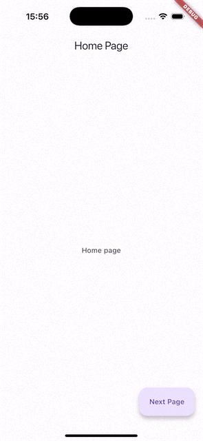

# Flutter Hero Page Route
### Create Hero-like Page Route Transitions in Flutter

## Synopsis

If you're unfamiliar with the [Hero class](https://api.flutter.dev/flutter/widgets/Hero-class.html), have a look at this [article about Hero animations](https://docs.flutter.dev/ui/animations/hero-animations). Hero is a powerful Flutter class that enables seamless transitions of widgets between routes.

In contrast to standard Hero animations, which transition a single widget between screens, we want to apply a Hero animation to the entire screen. This results in more dramatic and engaging transitions.

Another great thing about the Hero class is its composability. Like any other Flutter widget, it can be composed or extended, enabling cool route transitions that animate the entire screen content.

In our example, we seamlessly morph the FloatingActionButton into a new screen:



## Hero Animations

The [Hero class](https://api.flutter.dev/flutter/widgets/Hero-class.html) does most of the heavy lifting here by creating a smooth transition between the origin and destination widgets. But what if we want more control over the animation?

To switch routes, [Navigator.push()](https://docs.flutter.dev/cookbook/navigation/navigation-basics#2-navigate-to-the-second-route-using-navigator-push) expects a descendant of the [Route class](https://api.flutter.dev/flutter/widgets/Route-class.html), such as [MaterialPageRoute](https://api.flutter.dev/flutter/material/MaterialPageRoute-class.html). To create a custom route transition, we can use [PageRouteBuilder](https://api.flutter.dev/flutter/widgets/PageRouteBuilder-class.html) class, as described in this [recipe](https://docs.flutter.dev/cookbook/animation/page-route-animation).

To avoid wrapping each route in `PageRouteBuilder`, we extend it instead. We then call the superclass, and use its `pageBuilder` property to gain full control of the route transition animation.

The `pageBuilder` callback receives an `animation` argument that we can use to control the route transition. This allows us to animate other properties like shape, color, and elevation.

In order to apply a custom animation Curve, we extend the default MaterialRectArcTween class, responsible for Hero’s flight path, and pass it to the `createRectTween` property.

Finally, we wrap the Hero’s child in a `Material` widget. This enables us to transition between the initial and final shape, color, and elevation. We then `AnimatedBuilder` to run the animation.

Here’s what the code looks like:

```dart
import 'package:flutter/material.dart';

class CurvedRectTween extends MaterialRectArcTween {
  CurvedRectTween({
    required super.begin,
    required super.end,
    required this.curve,
  });

  final Curve curve;

  @override
  Rect lerp(double t) {
    return super.lerp(curve.transform(t));
  }
}

class HeroPageRoute extends PageRouteBuilder {
  final Color? color;
  final Curve curve;
  final double? elevation;
  final Duration duration;
  final ShapeBorder? shape;
  final String tag;
  final Widget child;

  HeroPageRoute({
    required this.child,
    required this.tag,
    this.color,
    this.curve = Curves.easeInOut,
    this.elevation,
    this.shape,
    this.duration = const Duration(milliseconds: 500),
  }) : super(
    transitionDuration: duration,
    reverseTransitionDuration: duration,
    pageBuilder: (
      BuildContext context,
      Animation<double> animation,
      Animation<double> secondaryAnimation,
    ) {
      final elevationTween = Tween<double>(
            begin: elevation ?? 0.0, 
            end: 0.0,
          ).chain(CurveTween(curve: curve));
      final opacityTween = Tween<double>(
            begin: 0.0, 
            end: 1.0,
          ).chain(CurveTween(curve: curve));
      final shapeTween = ShapeBorderTween(
            begin: shape ?? const RoundedRectangleBorder(borderRadius: BorderRadius.zero),
            end: const RoundedRectangleBorder(borderRadius: BorderRadius.zero),
          ).chain(CurveTween(curve: curve));
      final colorTween = ColorTween(
            begin: color ?? Colors.transparent,
            end: Colors.transparent,
          );

      return Hero(
        tag: tag,
        createRectTween: (Rect? begin, Rect? end) {
          return CurvedRectTween(begin: begin, end: end, curve: curve);
        },
        child: AnimatedBuilder(
          animation: animation,
          builder: (context, child) {
            return Material(
              elevation: elevationTween.evaluate(animation),
              shape: shapeTween.evaluate(animation),
              color: colorTween.evaluate(animation),
              clipBehavior: Clip.hardEdge,
              child: Opacity(
                opacity: opacityTween.evaluate(animation),
                child: child,
              ),
            );
          },
          child: child,
        ),
      );
    },
  );
}
```

## Putting It All Together

In our example, we want the second route’s content appear to originate from the [FloatingActionButton](https://api.flutter.dev/flutter/material/FloatingActionButton-class.html), so we use the button’s default properties as the starting point of our animation.

Unfortunately, some default properties might not be defined in the default theme (e.g. `Theme.of(context).floatingActionButtonTheme.shape`), so we use the null-coalescing (`??`) operator to provide backup values.

Since our HeroPageRoute is essentially a subclass of [Route](https://api.flutter.dev/flutter/widgets/Route-class.html), we can use the Navigator.of(context).push method to add it to the route stack. However, it still requires a tag for the Hero to use.

Finally, we can apply custom duration and curve. These are optional since Hero defaults to `Curves.fastOutSlowIn` and `PageRouteBuilder` uses a 300-millisecond transition by default.

```dart
import 'package:flutter/material.dart';
import 'package:flutter_hero_page_route/hero_page_route.dart';

void main() {
  runApp(const MyApp());
}

class MyApp extends StatelessWidget {
  const MyApp({super.key});

  @override
  Widget build(BuildContext context) {
    return MaterialApp(
      title: 'Flutter Hero Page Route',
      theme: ThemeData(
        useMaterial3: true,
        primarySwatch: Colors.deepPurple,
      ),
      home: const HomePage(),
    );
  }
}

class HomePage extends StatelessWidget {
  const HomePage({super.key});

  @override
  Widget build(BuildContext context) {
    return Scaffold(
      appBar: AppBar(
        title: const Text('Home Page'),
      ),
      body: const Center(
        child: Text('Home page'),
      ),
      floatingActionButton: FloatingActionButton.extended(
        heroTag: 'my_hero_route',
        onPressed: () {
          Navigator.of(context).push(
            HeroPageRoute(
              tag: 'my_hero_route',
              child: const NextPage(),
              curve: Curves.easeInOutSine,
              duration: const Duration(milliseconds: 1000),
              elevation: Theme.of(context).floatingActionButtonTheme.elevation ?? 6.0,
              shape: Theme.of(context).floatingActionButtonTheme.shape ??
                  const RoundedRectangleBorder(
                    borderRadius: BorderRadius.all(Radius.circular(16.0)),
                  ),
              color: Theme.of(context).floatingActionButtonTheme.backgroundColor ??
                      Theme.of(context).colorScheme.primaryContainer,
            ),
          );
        },
        label: const Text('Next Page'),
      ),
    );
  }
}

class NextPage extends StatelessWidget {
  const NextPage({super.key});

  @override
  Widget build(BuildContext context) {
    return Scaffold(
      appBar: AppBar(
        title: const Text('Next Page'),
      ),
      body: const Center(
        child: Text('Next page'),
      ),
    );
  }
}
```

## Conclusion

While Flutter generally favours [composition over inheritance](https://docs.flutter.dev/resources/inside-flutter#aggressive-composability), extending its classes can significantly enhance customization, leading to dramatic effects and highly personalized user interfaces.